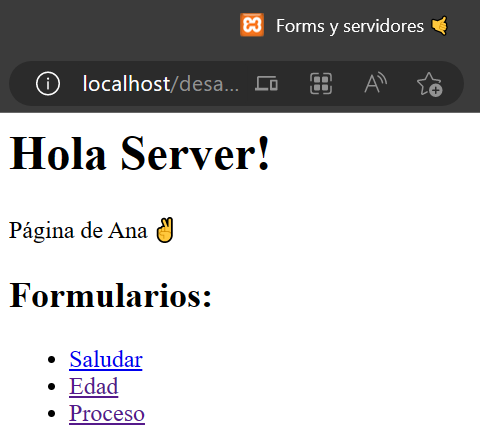

# Form Post con PHP

Estas actividades fueron desarrolladas usando **XAMPP** para ejecutar un servidor **Apache** local que soporte el lenguaje **PHP**.

## Requerimientos
Sólo se necesita instalar XAMPP.

## Desarrollo
Para poder ejecutar estos archivos, se requiere que estén ubicados en un folder dentro del directorio `\htdocs` dentro de la instalación local de **XAMPP**.

Nótese que el nombre dado a dicho folder será también parte de la dirección en la que se servirán los archivos.

## Uso
1. **Iniciar el servidor Apache de XAMPP.** Se recomienda iniciar XAMPP con permisos de administrador para evitar problemas al iniciar el servidor.
2. **Ingresar a la dirección correspondiente.** Por ejemplo, si los archivos se guardaron dentro de un folder `desa_internet`, entonces los archivos estarán servidos en http://localhost/desa_internet/
3. Si todo salió bien, se observará una pantalla como esta:

